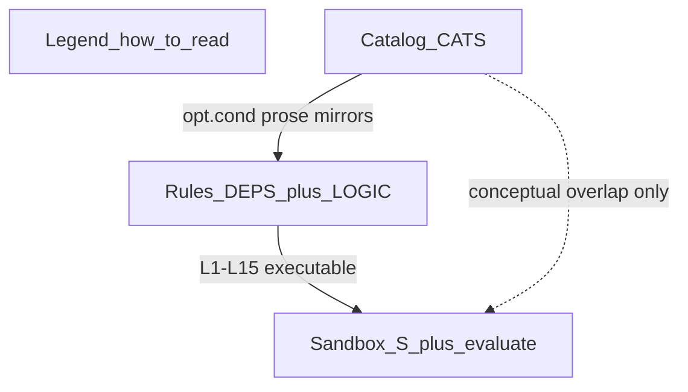
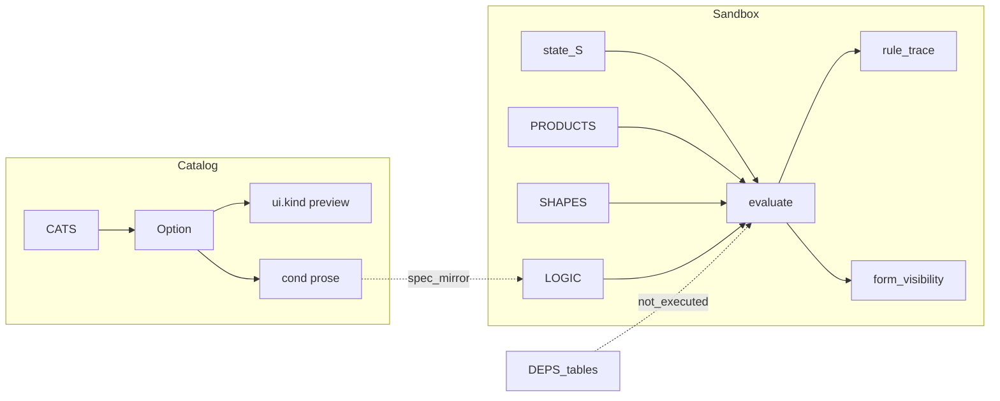

# Configurator HTML — structure map

Source of truth for the draft explorer; **Property Controls** is the React port.

| | |
| --- | --- |
| **Artifact** | [`../public/customization-logic-explorer.html`](../public/customization-logic-explorer.html) (~844 lines) — kept as static reference |
| **Admin host** | `/customization-library/property-controls` — React explorer (`PropertyControlsExplorer`) |
| **Removed** | `/customization-library/configurator-logic` iframe route |
| **Title in HTML** | Categories, Option Types & Conditional Logic |

This file is a **draft build-spec explorer**. It is **not** a Sanity property editor and **not** a JSON/JsonLogic rule builder.

---

## Page sections



| Section | Job | Data |
| --- | --- | --- |
| **How to read** (`#legend`) | Legend for pills / conditions / live | Static copy |
| **Categories & options** (`#catalog`) | Collapsible categories; each option = live control preview + spec + amber condition | `CATS` |
| **Logic sandbox** (`#sandbox`) | Inputs → rule trace → resulting form state | `S`, `PRODUCTS`, `SHAPES`, `evaluate()` |
| **Rules reference** (`#rules`) | A = mapping deps (not run); B = if/then logic (live in sandbox) | `DEPS`, `LOGIC` |

Sticky header: in-page nav + theme toggle (`.cfg-explorer[data-theme]`).

---

## Hierarchy (HTML terms)

```text
Category (CATS[])
  └── Option (opts[])
        ├── Spec: n, type, card (Single|Multi), req, src, vals, def
        ├── Condition: cond (HTML/prose — documentation)
        └── Control: ui (+ optional ui2 / uiCap / ui2Cap)
```

### Terminology corrections (HTML ↔ Studio)

Studio canon (binding for CMS / www): **Category → Type → Option → Property / Property Value**.

The HTML draft reuses overlapping English words at **different layers**. Do not equate names 1:1 when modularizing.

| HTML label | What it is in the explorer | Closest Studio concept | Do **not** treat as |
| --- | --- | --- | --- |
| Category (`CATS[].name`) | Top accordion group (Materials, Printing, …) | `customizationCategory` | — |
| Option (`opts[].n`) | One control row / panel (Material, Printed Side, Foiling, …) | **`customizationType`** (configurator panel / facet) | `customizationOption` |
| `card` Single / Multi | How many selections this control allows | Type `customerSelects` (`one` / `many`) | Property `valuesPerItem` |
| `ui.choices` / list items | Selectable entries under that control (SBS, Matte, Blind Embossing, …) | Usually **`customizationOption`** titles (sometimes Property Values) | The HTML “Option” row itself |
| `type` (pill, e.g. “List”, “Toggle”) | Control presentation hint | Maps toward `ui.kind`, not Studio Type | `customizationType` |
| `cond` | Prose rule for specialists | Future logic / PROD-2445 — not a document field today | — |
| Slice 0 `PropertyField` (removed) | Abstract Property / Property Value widgets | `property` + `propertyValue` | This catalog’s Option rows |

**Locked for the React port:** keep HTML field names in typed catalog data (`Category`, `CatalogOption`, `ui.kind`) so the draft stays faithful. In UI chrome and AGENTS prose, prefer Studio words when explaining intent (“Type panel”, “Option choices”) and call out the HTML↔Studio bridge — never rename Studio schemas to match the HTML.

**Nav label:** admin page stays **Property Controls** (existing library name). Content of that page is this explorer (catalog + sandbox + rules), not a Property/PropertyValue fixture gallery.

### Categories inventory

| `id` | Name | Options (`n`) |
| --- | --- | --- |
| `structure` | Structure | Product/Structure |
| `size` | Size | Dimensions, Size mode (Tin), Board caliper |
| `materials` | Materials | Material, Thickness, Board color, Corrugated flute |
| `printing` | Printing | Printed Side, Printing Method, Color System, Pantone Count, Pantone (PMS) codes, Ink, Ink set (chips) |
| `finishing` | Finishing | Surface Finish, Spot Coating, Foiling, Embossing & Debossing, Food-Safe Treatment |
| `structural` | Additional Customization | Handles, Opening & Access, Closures, Windows, Reinforcement & Utility, Embellishment, Need help? |

### `ui.kind` taxonomy

**Type-panel kinds** (from draft HTML): `readonly` · `dims` · `radio` · `radioPick` · `toggles` · `listbox` · `stepper` · `repeat`  
(handlers also exist for unused `select` / `checks` / `textUpload`)

**Property-value demo kinds** (added from Slice 0): `swatch` · `specTable` · `cardGrid` · `linkOut` · `chip`

Typical fields by kind:

| kind | Fields |
| --- | --- |
| `readonly` | `value` |
| `dims` | `unit` |
| `radio` | `choices`, `value` |
| `radioPick` | `choices`, `value`, `pick`, `unit` |
| `toggles` | `items[{label,value}]`, optional `hint` |
| `listbox` | `choices`, `value` or `values` + `multi`, optional `exclusive`, `hint` |
| `stepper` | `value`, `max` |
| `repeat` | `placeholder` |
| `swatch` | `swatches[{id,label,color?,imageUrl?}]`, optional `value` |
| `specTable` | `segments`, `columns`, `rows` |
| `cardGrid` | `cards[{id,name,meta?}]`, optional `value` |
| `linkOut` | `links[{label,href}]` |
| `chip` | `chips[{id,label}]`, `valuesPerItem` (`one`\|`many`), optional `values` |

**Printed Side** is the only option with a second preview: `ui` + `ui2` (+ captions).

---

## Two runtimes (must preserve)



| Surface | Interactive? | Writes `S`? | Fires L*? |
| --- | --- | --- | --- |
| Catalog live preview (`ctrl`) | Yes (local) | No | No |
| Catalog `cond` | Read-only | No | No |
| Sandbox inputs | Yes | Yes | Yes via `evaluate()` |
| Rules tables | No | No | Documentation; DEPS never run |

Catalog and sandbox share *concepts* (print modes, Soft Touch, Pantone, Tin size, shape→dims) but **not** one controlled state in this draft.

---

## Sandbox data

### State `S`

`product`, `shape`, `pOut`, `pIn`, `pSingle`, `color`, `pcount`, `finish`, `emboss[]`, `foiling`, `foam`, `covering`

### Supporting lists

- **`PRODUCTS`** — `{n, lvl, print}` where `print` ∈ `both` | `outside` | `single` | `none` (drives L1–L3)
- **`SHAPES`** — `{n, form, rule}` — `rule` is `L14` | `L15` | `null`
- Choice pools: `FINISHES`, `COLORS`, `EMBOSS`, `TEXTURED`, `COVERINGS`

### Logic rules `LOGIC` (L1–L15) — executable

| Id | Type | Summary |
| --- | --- | --- |
| L1 | Visibility | Outside-only print for Tin / Pouches / Mailers / Bags |
| L2 | Visibility | Single “Printed?” toggle for Labels / Stickers / Accessories / Cardboard Insert |
| L3 | Visibility | No printing section for insert styles |
| L4 | Visibility | All print toggles No → hide other printing fields |
| L5 | Visibility | Pantone / Hybrid → show count + PMS |
| L6 | Validation | Pantone count capped at 3 |
| L7 | Validation | One PMS entry per count |
| L8 | Availability | Soft Touch → deboss options unavailable |
| L9 | Availability | Textured emboss exclusive |
| L10 | Validation | Textured requires Uncoated finish |
| L11 | Validation | Foam + foiling needs covering |
| L12 | Validation | Foam + emboss needs Paper/Leather lamination |
| L13 | Availability | Tin size mode stock vs custom |
| L14 | Visibility | Cylinder → Diameter × Height |
| L15 | Visibility | Bag/Pouch → W × H × Gusset |

### Field dependencies `DEPS` (D1–D12) — reference only

List contents driven by mapping tables (Materials, Thickness, Printing Method, Color System, Ink, finishes, add-ons, dimension form). **Not simulated** in the sandbox.

Boot order: `renderCatalog(); renderDeps(); renderLogic(); evaluate();`

---

## Overlap with retired Slice 0

| Slice 0 (`PropertyField*`, removed) | This explorer |
| --- | --- |
| `PropertyRenderType`: swatch, chip, specTable, … | `ui.kind`: listbox, toggles, dims, … |
| Fixture gallery of abstract **Property / Property Value** controls | Full **Category → Type-panel** catalog + conditions + sandbox + rules |
| Aimed at Studio `property` / `propertyValue` | Aimed at configurator **Type** rows (`opts[]`); list choices ≈ Options |

Do **not** shoehorn `CATS` into a PropertyField model. Property Controls is this explorer. Property-level widgets may return later for www detail rails; they are a different layer than this catalog.

---

## Proposed module seams (implemented)

| Module | Responsibility | Location |
| --- | --- | --- |
| Catalog data | Typed `Category` / `CatalogOption` / `UiDescriptor` | `src/lib/customization/catalog-data.ts` |
| Control primitives | One component per `ui.kind` + shared dispatcher | `@pakfactory/ui` `property-controller/*` and `PropertyController`; admin `catalog-control.tsx` is a thin re-export |
| Preview card chrome | Titled panel around a controller (not the controller itself) | `@pakfactory/ui` `PropertyFieldPanel`; used by www Option/Type controllers and admin catalog live preview |
| Category accordion + option cards | Collapse/expand; preview + spec + condition | `catalog-section.tsx` |
| Sandbox state + engine | `S`, `evaluate()`, L1–L15 | `sandbox-engine.ts` + `rules-data.ts` |
| Sandbox panels | Inputs / trace / form state | `sandbox-section.tsx` |
| Rules tables | DEPS + LOGIC presentational | `rules-section.tsx` |
| Page shell | Legend, section nav; theme toggle | `property-controls-explorer.tsx` |

**Host:** [`/customization-library/property-controls`](../src/app/(admin)/customization-library/property-controls/page.tsx). Iframe route and Slice 0 gallery removed.

### Out of scope

- Live Sanity or PROD-2445 wiring
- Unifying catalog click-state with sandbox `S` (HTML keeps them separate)
- Deleting the static `public/customization-logic-explorer.html` reference
