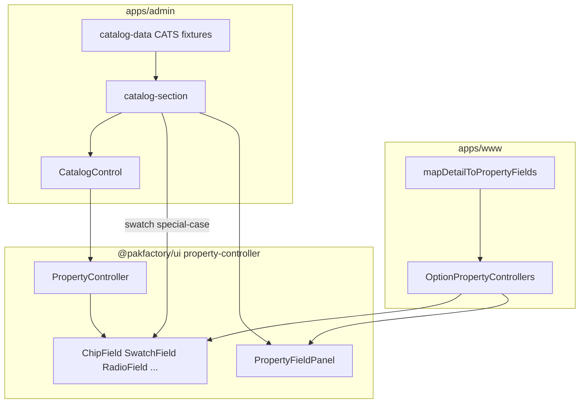

# Property Controls — admin ↔ www UI parity

Handoff for an **admin feature branch**: make the Property Controls explorer match the **www option Configuration rail** one-to-one (visual + interaction), using shared `@pakfactory/ui` primitives.

This doc is the brief. It does **not** implement the UI.

Related: [`configurator-html-structure.md`](./configurator-html-structure.md) (HTML → React explorer map).

---

## Goal

Staff opening `/customization-library/property-controls` should see the same control chrome and behavior buyers see on www when configuring an option — panels, consultation, chips, swatches, radios, etc.

**Gold standard:** www product configurator → Materials → **[TEST] Controller Lab — Alpha** (development seed `seed:controller-lab`). That option declares every Studio Customer control; the Configuration rail is the reference.

**Admin host today:** [`/customization-library/property-controls`](../src/app/(admin)/customization-library/property-controls/page.tsx) → [`PropertyControlsExplorer`](../src/components/customization-library/property-controls-explorer.tsx) → catalog previews in [`catalog-section.tsx`](../src/components/customization-library/catalog-section.tsx).

---

## Architecture (who owns what)

| Layer | Location | Role |
| --- | --- | --- |
| **Primitives** | [`packages/ui/src/components/customization/property-controller/`](../../packages/ui/src/components/customization/property-controller/) | Props-only fields + `PropertyController` dispatcher. **Do not fork in admin.** |
| **Www wiring** | [`option-property-controllers.tsx`](../../www/src/components/customization/option-property-controllers.tsx) + [`map-detail-to-property-fields.ts`](../../www/src/lib/catalog/map-detail-to-property-fields.ts) | Catalog → fields; consultation; Pantone; dimensions; `PropertyFieldPanel` title / titleValue |
| **Admin today** | [`catalog-control.tsx`](../src/components/customization-library/catalog-control.tsx) re-exports `PropertyController`; fixtures in [`catalog-data.ts`](../src/lib/customization/catalog-data.ts) | Uncontrolled demos; swatch preview is controlled locally for live title |

Kind naming mismatch to remember:

| Studio / www `PropertyControlKind` | `@pakfactory/ui` `UiKind` |
| --- | --- |
| `card` | `cardGrid` |
| `swatchShades` | *(not on `PropertyController` — www-only composition)* |
| `pantone` | *(www-only — PantonePropertyControllers)* |

---

## Interaction rules to match (www)

These come from `OptionPropertyControllers` with `consultationDefault` (builder / detail rails). Admin gallery should reproduce them when claiming parity.

1. **PropertyFieldPanel** — title = property label; `titleValue` = current selection (e.g. `Lab Chips: Need consultation`). Www uses `variant` `card` | `ghost` (builder uses ghost).
2. **Need consultation** — prepend a synthetic option (`PROPERTY_CONSULTATION_ID`) with dashed / consultation appearance on chips and swatches; exclusive with real catalog values.
3. **Custom Color** — after selecting a custom-color swatch (slug / appearance), show the custom-color reference panel.
4. **valuesPerItem** — `chip` / `listbox` / `toggles`: `one` vs `many` must match Studio “Customer may select”.
5. **radioPick** — choice titles containing “Stock” / “Custom” drive reveal (stock pick vs dimension inputs). Keep those substrings in fixture labels.
6. **swatchShades** — base swatches + shade children (`kindOf`); not a `PropertyController` kind — compose in the wiring layer like www.
7. **pantone** / **dimension** — no authored Property Values required on www; emit from declaration. Admin fixtures must still demo the same widgets.

---

## Parity checklist

Use this as the branch acceptance list. “Done when” = side-by-side with www Controller Lab Alpha looks and behaves the same for that control.

| Control | Www behavior | Admin today | Gap | Done when |
| --- | --- | --- | --- | --- |
| `chip` (one) | `ChipField` + consultation + panel titleValue | `UiKind: chip` via `PropertyController` | No consultation prepend; panel title often static | Matches Alpha “Lab Chips” row |
| `chip` (many) | `valuesPerItem: many` | Multi chip fixtures exist in CATS | Confirm multi + consultation parity | Matches “Lab Chips several” |
| `swatch` | Controlled swatches + consult + custom color panel | Controlled `SwatchField` + dynamic panel title; no consult/custom panel | Add consultation + custom-color follow-up | Matches “Lab Swatch” |
| `swatchShades` | Www `SwatchShadesField` composition | Not in admin catalog dispatcher | Add fixture + compose like www (do not invent a second shade UI) | Matches “Lab Swatch shades” |
| `radio` | `RadioField` choices | `radio` via `PropertyController` | Consultation titleValue / empty state | Matches “Lab Radio” |
| `radioPick` | Stock / Custom reveals | `radioPick` fixtures exist | Align labels + reveal UX with www | Matches “Lab Radio pick” |
| `listbox` | Single / multi list | `listbox` via `PropertyController` | Consultation + many mode if shown on www | Matches “Lab List” |
| `card` | `CardGridField` (`card` → ui `cardGrid`) | `cardGrid` fixtures | Panel + selection parity | Matches “Lab Cards” |
| `toggles` | Multi toggles | `toggles` via `PropertyController` | Consultation / many parity | Matches “Lab Toggles” |
| `readonly` | Fixed value display | `readonly` fixtures | TitleValue style | Matches “Lab Read-only” |
| `specTable` | Spec segments from facts | `specTable` via `PropertyController` | Fact → segment shape like www | Matches “Lab Spec table” |
| `pantone` | Www Pantone controllers | Not in admin explorer | Demo or extract shared props-only shell | Matches “Lab Pantone” |
| `dimension` | Axes / unsure / unit | Dimension demos in CATS | Match www panel + unsure treatment | Matches “Lab Dimensions” |

---

## Implementation constraints (ADR-013)

1. **Edit primitives only for confirmed shared bugs** — prefer composing [`packages/ui/.../property-controller`](../../packages/ui/src/components/customization/property-controller/). Do not copy field components into `apps/admin`.
2. **Do not copy `OptionPropertyControllers` into admin** — if admin needs the same wiring (consultation, pantone, shade tree), extract a **props-only** helper into `@pakfactory/ui` or a shared feature package, then use it from www and admin.
3. **Fixtures stay local** — update [`catalog-data.ts`](../src/lib/customization/catalog-data.ts) so labels/options mirror Controller Lab; do not patch live Sanity catalog from admin.
4. **Swatch special-case** — [`catalog-section.tsx`](../src/components/customization-library/catalog-section.tsx) bypasses `PropertyController` for live titles. Prefer converging on the same controlled pattern www uses rather than growing a second swatch path.
5. **CSS cascade** — `@pakfactory/ui/globals.css` → admin `globals.css` → `className`. No one-off hex/spacing that diverges from www.

---

## Suggested branch work order

1. Add a **Controller Lab** category (or section) in `CATS` whose rows mirror Alpha’s 13 controls (including consultation-capable fixtures).
2. Bring panel title / titleValue behavior in line with www for every preview (not only swatch).
3. Close checklist gaps for `swatchShades`, `pantone`, consultation, custom color.
4. Extract shared wiring only if step 2–3 would otherwise duplicate www logic.
5. Verify (below), then open PR with base **`www-new-release`** (admin is on the www rebuild trunk per AGENTS.md).

---

## Verification

| Step | Action |
| --- | --- |
| 1 | Www (dev): product `test-custom-3-tier-drawer-rigid-box` → Materials → **[TEST] Controller Lab — Alpha** → Configuration rail |
| 2 | Admin: `pnpm dev:admin` → `/customization-library/property-controls` → Controller Lab / matching fixtures |
| 3 | Walk the checklist table; screenshot pairs for any failing control |
| 4 | Confirm no Sanity document writes; fixture-only admin changes |

Controller Lab content is seeded separately (`pnpm --filter @pakfactory/studio run seed:controller-lab -- --dataset development --confirm`). **This parity work does not require re-seeding** unless the gold-standard option is missing.

---

## Out of scope

- Studio schema / Customer control field changes
- Controller Lab seed script changes (unless titles/fixtures need sync)
- Production catalog or production dataset writes
- Full product builder / RFQ state machine inside admin (request detail stays summary-only unless a later ticket says otherwise)
- Sandbox L1–L15 / DEPS tables (keep; not the www Configuration rail)

---

## File map (quick)

| Path | Touch for parity? |
| --- | --- |
| [`apps/admin/src/lib/customization/catalog-data.ts`](../src/lib/customization/catalog-data.ts) | Yes — fixtures |
| [`apps/admin/src/components/customization-library/catalog-section.tsx`](../src/components/customization-library/catalog-section.tsx) | Yes — preview shell / consultation |
| [`apps/admin/src/components/customization-library/catalog-control.tsx`](../src/components/customization-library/catalog-control.tsx) | Only if dispatcher API changes |
| [`apps/www/src/components/customization/option-property-controllers.tsx`](../../www/src/components/customization/option-property-controllers.tsx) | Reference; extract from here if sharing wiring |
| [`packages/ui/.../property-controller/*`](../../packages/ui/src/components/customization/property-controller/) | Shared bugfixes only |
